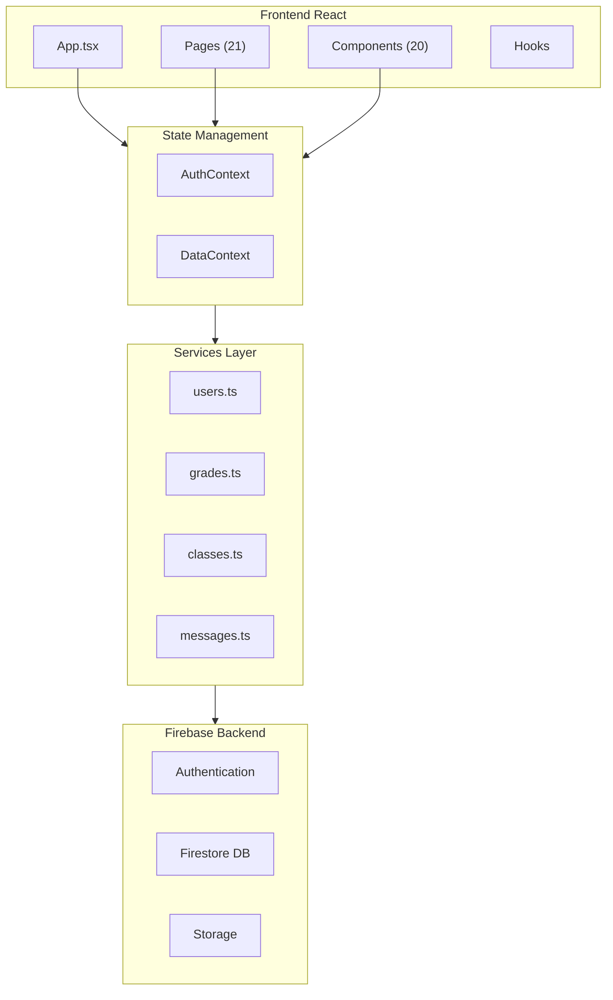
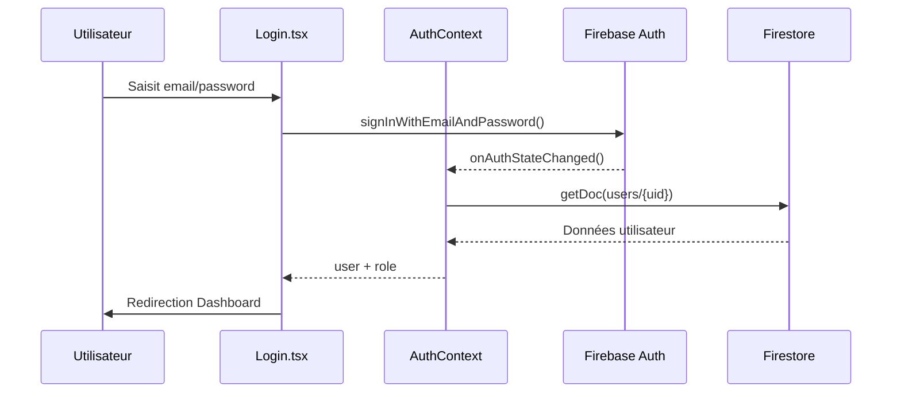
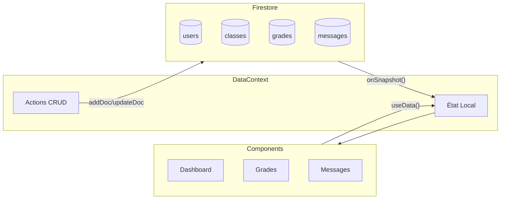
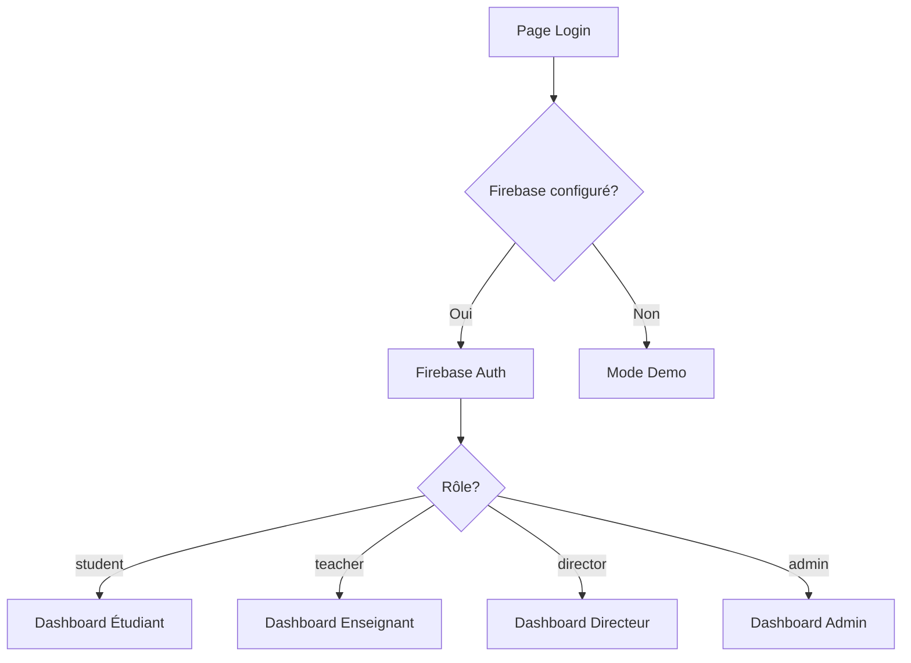
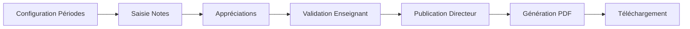

# 🕌 SmartMadrasa

**Système de Gestion Scolaire Islamique** - Application web multilingue (FR/NL/AR) pour la gestion complète d'une école.

---

## 📋 Sommaire

1. [Présentation](#1-présentation)
2. [Technologies](#2-technologies)
3. [Architecture](#3-architecture)
4. [Installation](#4-installation)
5. [Structure du Projet](#5-structure-du-projet)
6. [Configuration](#6-configuration)
7. [Modules Fonctionnels](#7-modules-fonctionnels)
8. [Documentation Technique](#8-documentation-technique)

---

## 1. Présentation

SmartMadrasa est une plateforme complète de gestion scolaire offrant :

| Fonctionnalité    | Description                                         |
| ----------------- | --------------------------------------------------- |
| **Multi-rôles**   | Étudiant, Parent, Enseignant, Directeur, SuperAdmin |
| **Multilingue**   | Français, Néerlandais, Arabe (avec support RTL)     |
| **Temps réel**    | Synchronisation instantanée via Firebase            |
| **Bulletins PDF** | Génération automatique des bulletins scolaires      |
| **Mode sombre**   | Thème adaptatif clair/sombre                        |

---

## 2. Technologies

### Frontend

| Package      | Usage                |
| ------------ | -------------------- |
| React 19     | Framework UI         |
| TypeScript   | Typage statique      |
| Tailwind CSS | Styles utility-first |
| Vite         | Build tool           |

### Backend (Firebase)

| Service   | Usage            |
| --------- | ---------------- |
| Auth      | Authentification |
| Firestore | Base de données  |
| Storage   | Fichiers         |

### Librairies

| Package          | Usage                |
| ---------------- | -------------------- |
| react-router-dom | Navigation           |
| i18next          | Internationalisation |
| jspdf            | Génération PDF       |
| recharts         | Graphiques           |
| lucide-react     | Icônes               |
| xlsx             | Export Excel         |

---

## 3. Architecture

### Vue d'ensemble



### Flux d'authentification



### Flux de données



---

## 4. Installation

```bash
# 1. Cloner
git clone <repo-url>
cd smartschool

# 2. Installer
npm install

# 3. Configurer
cp .env.example .env
# Éditer .env avec vos credentials Firebase

# 4. Lancer
npm run dev
```

---

## 5. Structure du Projet

```
src/
├── config/
│   └── firebase.ts          # Configuration Firebase
│
├── context/
│   ├── AuthContext.tsx      # Gestion authentification
│   └── DataContext.tsx      # État global des données
│
├── services/                 # 18 services CRUD
│   ├── users.ts
│   ├── classes.ts
│   ├── grades.ts
│   ├── attendance.ts
│   ├── messages.ts
│   ├── events.ts
│   ├── courses.ts
│   ├── homework.ts
│   └── ...
│
├── types/
│   ├── index.ts             # Types principaux
│   └── bulletin.ts          # Types bulletins
│
├── components/
│   ├── UI/                  # Card, Button, Modal, Input
│   ├── Layout/              # MainLayout, Sidebar
│   ├── Grades/              # Vues des notes
│   ├── Schedule/            # Modales emploi du temps
│   └── bulletin/            # Aperçu bulletins
│
├── pages/
│   ├── auth/Login.tsx
│   ├── common/              # Dashboard, Messages, Schedule...
│   ├── admin/               # Users, Analytics, Settings
│   ├── director/            # Classes, BulletinDashboard
│   ├── teacher/             # Grades, Attendance
│   └── student/             # StudentBulletin
│
├── locales/                 # Traductions FR/NL/AR
├── hooks/                   # useGradeStats
├── utils/                   # pdfGenerator, gradeReports
└── styles/                  # theme.css
```

---

## 6. Configuration

### Variables d'environnement (.env)

```env
VITE_FIREBASE_API_KEY=xxx
VITE_FIREBASE_AUTH_DOMAIN=xxx.firebaseapp.com
VITE_FIREBASE_PROJECT_ID=xxx
VITE_FIREBASE_STORAGE_BUCKET=xxx.appspot.com
VITE_FIREBASE_MESSAGING_SENDER_ID=xxx
VITE_FIREBASE_APP_ID=xxx
```

### Configuration Firebase (firebase.ts)

```typescript
// Lecture des variables d'environnement
const firebaseConfig = {
  apiKey: import.meta.env.VITE_FIREBASE_API_KEY,
  authDomain: import.meta.env.VITE_FIREBASE_AUTH_DOMAIN,
  // ...
};

// Vérification et initialisation
if (isFirebaseConfigured) {
  app = initializeApp(firebaseConfig);
  auth = getAuth(app);
  db = getFirestore(app);
  storage = getStorage(app);
}
```

---

## 7. Modules Fonctionnels

### 7.1 Authentification



### 7.2 Gestion des Notes

| Composant           | Rôle                              |
| ------------------- | --------------------------------- |
| `TeacherGradesView` | Saisie des notes par l'enseignant |
| `StudentGradesView` | Consultation par l'élève          |
| `ParentGradesView`  | Consultation par le parent        |
| `BulkGradeModal`    | Saisie en masse par classe        |
| `GradeCard`         | Affichage d'une note              |

### 7.3 Bulletins Scolaires



### 7.4 Emploi du Temps

| Type       | Description       |
| ---------- | ----------------- |
| `lesson`   | Cours régulier    |
| `exam`     | Examen            |
| `homework` | Devoir à rendre   |
| `event`    | Événement spécial |

### 7.5 Messagerie

- Messages individuels entre utilisateurs
- Broadcast à une classe
- Pièces jointes via Firebase Storage
- Marquage lu/non-lu

---

## 8. Documentation Technique

### 8.1 AuthContext

**Fichier:** `context/AuthContext.tsx`

**Responsabilités:**

- Observer l'état d'authentification Firebase
- Charger le profil utilisateur depuis Firestore
- Fournir le hook `useAuth()`

**Hooks exposés:**

```typescript
const { user, loading, logout } = useAuth();
```

### 8.2 DataContext

**Fichier:** `context/DataContext.tsx`

**Responsabilités:**

- Gérer l'état global de toutes les entités
- S'abonner aux collections Firestore en temps réel
- Fallback vers données mock si Firebase non configuré

**Hooks exposés:**

```typescript
const {
  users,
  students,
  classes,
  messages,
  events,
  grades,
  attendance,
  courses,
  homeworks,
  academicPeriods,
  gradeCategories,
  // Actions CRUD
  addUser,
  updateUser,
  deleteUser,
  addClass,
  updateClass,
  deleteClass,
  // ...
} = useData();
```

### 8.3 Types Principaux

```typescript
// Rôles utilisateur
type Role = 'student' | 'parent' | 'teacher' | 'director' | 'superadmin';

// Utilisateur de base
interface User {
  id: string;
  name: string;
  email: string;
  role: Role;
  avatar?: string;
}

// Étudiant (hérite de User)
interface Student extends User {
  role: 'student';
  classId: string;
  parentId: string;
}

// Note
interface Grade {
  id: string;
  studentId: string;
  subject: string;
  score: number;
  maxScore: number;
  type: 'exam' | 'homework' | 'participation';
  date: string;
  feedback?: string;
}

// Présence
interface Attendance {
  id: string;
  date: string;
  studentId: string;
  status: 'present' | 'absent' | 'late';
  classId: string;
  justification?: string;
}
```

### 8.4 Services Firebase

Chaque service suit le même pattern :

```typescript
// Exemple: services/users.ts

// Lecture
export const getUsers = async (): Promise<User[]>
export const getUserById = async (id: string): Promise<User | null>

// Écriture
export const createUser = async (user: Omit<User, 'id'>): Promise<string>
export const updateUser = async (id: string, updates: Partial<User>): Promise<void>
export const deleteUser = async (id: string): Promise<void>

// Temps réel
export const subscribeToUsers = (callback: (users: User[]) => void) => Unsubscribe
```

### 8.5 Génération PDF

**Fichier:** `utils/pdfGenerator.ts`

```typescript
// Bulletin individuel
generateStudentBulletinPDF(data: BulletinData): jsPDF

// Bulletins de toute la classe
generateClassBulletinPDF(dataList: BulletinData[], className: string): jsPDF
```

Structure du PDF généré:

1. En-tête avec nom de l'école
2. Informations élève et période
3. Tableau des notes par matière
4. Moyenne générale
5. Statistiques d'assiduité
6. Zones de signatures

### 8.6 Internationalisation

**Fichier:** `i18n.ts`

Langues supportées:

- 🇫🇷 Français (défaut)
- 🇳🇱 Néerlandais
- 🇸🇦 Arabe (RTL)

Usage dans les composants:

```typescript
const { t } = useTranslation();
<h1>{t('dashboard.title')}</h1>
```

### 8.7 Composants UI

| Composant | Props                        | Description          |
| --------- | ---------------------------- | -------------------- |
| `Card`    | children, className, onClick | Conteneur avec ombre |
| `Button`  | variant, size, icon          | Bouton stylisé       |
| `Badge`   | variant, children            | Étiquette colorée    |
| `Input`   | label, error, icon           | Champ de saisie      |
| `Modal`   | isOpen, onClose, title       | Fenêtre modale       |

Variantes Button: `primary`, `secondary`, `danger`, `ghost`
Variantes Badge: `success`, `warning`, `error`, `info`, `neutral`

---

## 🧪 Commandes

```bash
npm run dev      # Développement
npm run build    # Production
npm run preview  # Aperçu build
npm run lint     # Vérification code
```

---

## 📄 Licence

Développé pour un usage éducatif.

---

**Développé avec ❤️ pour l'éducation**
