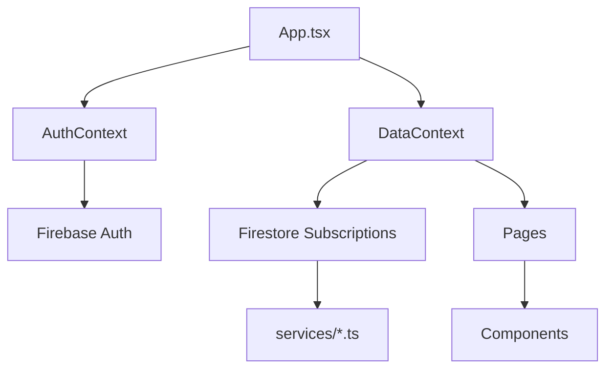

# SmartSchool - Architecture Documentation

Cette documentation explique la structure et le fonctionnement de chaque fichier de l'application SmartSchool.

---

## 📁 Structure Racine (`src/`)

### Fichiers Principaux

| Fichier     | Description                                                                              |
| ----------- | ---------------------------------------------------------------------------------------- |
| `main.tsx`  | **Point d'entrée** de l'application. Configure React, i18n, et monte le composant `App`. |
| `App.tsx`   | **Router principal**. Définit toutes les routes protégées et lazy-load les pages.        |
| `App.css`   | Styles globaux CSS de base (peu utilisé, remplacé par Tailwind).                         |
| `index.css` | **Styles Tailwind + thème**. Importe les directives Tailwind et le fichier theme.css.    |
| `i18n.ts`   | **Configuration i18next**. Initialise la traduction multilingue (FR/NL/AR).              |

---

## 📁 `context/` — Contextes React

| Fichier           | Description                                                                                                                                   |
| ----------------- | --------------------------------------------------------------------------------------------------------------------------------------------- |
| `AuthContext.tsx` | Gère l'**authentification Firebase**. Fournit `user`, `login()`, `logout()`, `register()`.                                                    |
| `DataContext.tsx` | **Hub de données centralisé**. Gère les subscriptions Firestore et expose toutes les données (students, grades, courses, etc.) via des hooks. |

---

## 📁 `services/` — Services Firebase/Firestore

Ces fichiers contiennent les fonctions CRUD pour chaque collection Firestore.

| Fichier               | Collection Firestore | Fonctions principales                                        |
| --------------------- | -------------------- | ------------------------------------------------------------ |
| `users.ts`            | `users`              | Création utilisateur, récupération, update                   |
| `students.ts`         | —                    | (Géré par users.ts avec role='student')                      |
| `classes.ts`          | `classes`            | CRUD pour les classes/groupes                                |
| `courses.ts`          | `courses`            | CRUD pour les cours (matière + horaire)                      |
| `grades.ts`           | `grades`             | CRUD pour les notes individuelles                            |
| `attendance.ts`       | `attendance`         | Gestion des présences                                        |
| `homework.ts`         | `homework`           | Devoirs avec dates limites                                   |
| `messages.ts`         | `messages`           | Messagerie interne                                           |
| `events.ts`           | `events`             | Événements calendrier (exams, évaluations)                   |
| `storage.ts`          | Firebase Storage     | Upload/download de fichiers (ressources)                     |
| `academicPeriods.ts`  | `academicPeriods`    | Trimestres/périodes scolaires                                |
| `gradeCategories.ts`  | `gradeCategories`    | Catégories de notes (devoirs, examens, etc.)                 |
| `courseGrades.ts`     | `courseGrades`       | Notes par cours pour bulletins                               |
| `teacherComments.ts`  | `teacherComments`    | Commentaires prof sur bulletins                              |
| `firebaseHelper.ts`   | —                    | Helpers utilitaires Firebase                                 |
| `initFirebase.ts`     | —                    | **Initialisation complète** de Firebase avec données de test |
| `seedDatabase.ts`     | —                    | Seed de données de démonstration                             |
| `seedBulletinData.ts` | —                    | Seed spécifique pour système de bulletins                    |

---

## 📁 `components/` — Composants Réutilisables

### `Layout/`

| Fichier                | Description                                                                             |
| ---------------------- | --------------------------------------------------------------------------------------- |
| `MainLayout.tsx`       | **Layout principal**. Contient la sidebar et le contenu. Applique les classes de thème. |
| `Sidebar.tsx`          | **Navigation latérale**. Menu dynamique selon le rôle utilisateur.                      |
| `NotificationBell.tsx` | Icône de notification avec badge et dropdown.                                           |

### `Auth/`

| Fichier              | Description                                        |
| -------------------- | -------------------------------------------------- |
| `ProtectedRoute.tsx` | HOC qui redirige vers `/login` si non authentifié. |

### `UI/`

| Fichier      | Description                                                               |
| ------------ | ------------------------------------------------------------------------- |
| `index.tsx`  | Exporte les composants UI réutilisables (`Card`, `Button`, `PageLoader`). |
| `Card.tsx`   | Composant carte stylisé avec ombre et bordure.                            |
| `Button.tsx` | Bouton avec variantes (primary, secondary, ghost, danger).                |

### `Grades/`

| Fichier                 | Description                                              |
| ----------------------- | -------------------------------------------------------- |
| `GradeCard.tsx`         | Carte de note avec indicateur circulaire de progression. |
| `GradeModal.tsx`        | Modal pour ajouter/éditer une note individuelle.         |
| `BulkGradeModal.tsx`    | Modal pour saisie de notes en masse (toute la classe).   |
| `StudentGradesView.tsx` | Vue des notes pour les **étudiants**.                    |
| `ParentGradesView.tsx`  | Vue des notes pour les **parents**.                      |
| `TeacherGradesView.tsx` | Vue de gestion des notes pour les **enseignants**.       |

### `Schedule/`

| Fichier                   | Description                                              |
| ------------------------- | -------------------------------------------------------- |
| `UpcomingEventsModal.tsx` | Modal affichant les événements à venir (exams, devoirs). |
| `HomeworkDetailModal.tsx` | Détail d'un devoir spécifique.                           |
| `ExamModal.tsx`           | Modal pour créer/éditer un examen ou évaluation.         |
| `CourseModal.tsx`         | Modal pour créer/éditer un cours.                        |

### `bulletin/`

| Fichier                      | Description                       |
| ---------------------------- | --------------------------------- |
| `BulletinPreview.tsx`        | Aperçu PDF du bulletin scolaire.  |
| `ClassBulletinListModal.tsx` | Liste des bulletins d'une classe. |

### Autres

| Fichier                | Description                     |
| ---------------------- | ------------------------------- |
| `LanguageSwitcher.tsx` | Sélecteur de langue (FR/NL/AR). |

---

## 📁 `pages/` — Pages de l'Application

### `auth/`

| Fichier     | Route    | Description                           |
| ----------- | -------- | ------------------------------------- |
| `Login.tsx` | `/login` | Page de connexion avec Firebase Auth. |

### `common/` — Accessibles à tous les rôles

| Fichier             | Route            | Description                                                |
| ------------------- | ---------------- | ---------------------------------------------------------- |
| `Dashboard.tsx`     | `/`              | Tableau de bord principal avec statistiques par rôle.      |
| `Messages.tsx`      | `/messages`      | Messagerie interne.                                        |
| `Homework.tsx`      | `/homework`      | Gestion des devoirs (création pour prof, vue pour élève).  |
| `Schedule.tsx`      | `/schedule`      | Emploi du temps visuel par jour/semaine.                   |
| `Calendar.tsx`      | `/calendar`      | Calendrier mensuel des événements.                         |
| `Announcements.tsx` | `/announcements` | Annonces et actualités.                                    |
| `Resources.tsx`     | `/resources`     | Partage de documents et ressources.                        |
| `Profile.tsx`       | `/profile`       | Profil utilisateur.                                        |
| `Settings.tsx`      | `/settings`      | Paramètres (thème, langue, notifications).                 |
| `Notifications.tsx` | —                | Composant de notifications (utilisé par NotificationBell). |

### `teacher/` — Pages Enseignant

| Fichier              | Route               | Description                                                                                                |
| -------------------- | ------------------- | ---------------------------------------------------------------------------------------------------------- |
| `Grades.tsx`         | `/grades`           | **Router de notes**. Affiche `StudentGradesView`, `ParentGradesView` ou `TeacherGradesView` selon le rôle. |
| `Attendance.tsx`     | `/attendance`       | Gestion des présences par cours.                                                                           |
| `BulletinGrades.tsx` | `/bulletins/grades` | Saisie des notes pour les bulletins officiels.                                                             |

### `director/` — Pages Directeur

| Fichier                  | Route                  | Description                             |
| ------------------------ | ---------------------- | --------------------------------------- |
| `Classes.tsx`            | `/classes`             | Gestion des classes et groupes.         |
| `AcademicYearConfig.tsx` | `/bulletins/config`    | Configuration des périodes académiques. |
| `BulletinDashboard.tsx`  | `/bulletins/dashboard` | Tableau de bord des bulletins.          |

### `student/`

| Fichier               | Route             | Description                   |
| --------------------- | ----------------- | ----------------------------- |
| `StudentBulletin.tsx` | `/bulletins/view` | Vue du bulletin pour l'élève. |

### `admin/` — Pages Admin

| Fichier             | Route              | Description                      |
| ------------------- | ------------------ | -------------------------------- |
| `Users.tsx`         | `/users`           | Gestion des utilisateurs (CRUD). |
| `Analytics.tsx`     | `/admin/analytics` | Statistiques et rapports.        |
| `AdminSettings.tsx` | `/admin/settings`  | Paramètres système.              |
| `DatabaseAdmin.tsx` | `/admin/database`  | Administration base de données.  |

---

## 📁 `hooks/` — Hooks Personnalisés

| Fichier            | Description                                                                     |
| ------------------ | ------------------------------------------------------------------------------- |
| `useGradeStats.ts` | Calcule les statistiques de notes (moyenne, taux de présence) pour un étudiant. |

---

## 📁 `utils/` — Utilitaires

| Fichier           | Description                                                     |
| ----------------- | --------------------------------------------------------------- |
| `gradeReports.ts` | Génère les rapports PDF de notes (bulletin individuel).         |
| `pdfGenerator.ts` | Fonctions génériques de génération PDF (utilisé par bulletins). |
| `lang.ts`         | Helpers pour la détection de langue et direction RTL.           |

---

## 📁 `types/` — Types TypeScript

| Fichier       | Description                                                                                  |
| ------------- | -------------------------------------------------------------------------------------------- |
| `index.ts`    | **Définition principale** de tous les types/interfaces (User, Student, Grade, Course, etc.). |
| `bulletin.ts` | Types spécifiques au système de bulletins.                                                   |

---

## 📁 `styles/` — Styles Additionnels

| Fichier     | Description                                                                    |
| ----------- | ------------------------------------------------------------------------------ |
| `theme.css` | Variables CSS pour les thèmes clair/sombre. Contient les couleurs sémantiques. |

---

## 📁 `locales/` — Traductions

| Dossier               | Description                 |
| --------------------- | --------------------------- |
| `fr/translation.json` | Traductions françaises.     |
| `nl/translation.json` | Traductions néerlandaises.  |
| `ar/translation.json` | Traductions arabes (+ RTL). |

---

## 📁 `config/`

| Fichier       | Description                                    |
| ------------- | ---------------------------------------------- |
| `firebase.ts` | Configuration Firebase (API keys, project ID). |

---

## 📁 `assets/`

Contient les assets statiques (images, icônes).

---

## 🔄 Flux de Données

1. `App.tsx` wrap l'application dans `AuthProvider` et `DataProvider`
2. `AuthContext` gère la session utilisateur via Firebase Auth
3. `DataContext` s'abonne aux collections Firestore via les services
4. Les pages consomment les données via `useData()` et `useAuth()`
5. Les composants reçoivent les données en props

---

## 🎨 Système de Thème

Le thème (clair/sombre) fonctionne via:

1. Classe `dark` sur `<html>` (ajoutée par Settings.tsx)
2. Variables CSS dans `theme.css` (ex: `--color-bg-primary`)
3. Classes Tailwind qui utilisent ces variables

---

## 🌍 Internationalisation

1. `i18n.ts` configure i18next avec les fichiers de `locales/`
2. `LanguageSwitcher.tsx` permet de changer la langue
3. `useTranslation()` hook pour accéder aux traductions
4. Direction RTL automatique pour l'arabe via `lang.ts`
