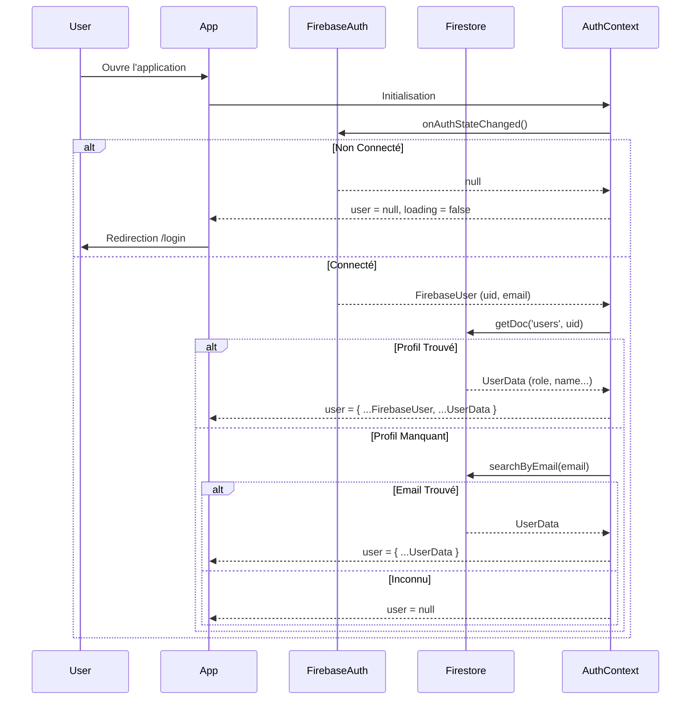

# AuthContext

Le `AuthContext` est responsable de la gestion de l'identité de l'utilisateur et de sa session.

## 🎯 Objectif

- Surveiller l'état de connexion Firebase (`onAuthStateChanged`).
- Récupérer le profil utilisateur enrichi depuis Firestore (rôle, classe, etc.).
- Fournir l'objet `user` globalement à l'application.

## 🔄 Flux d'Authentification

## 🛠️ API Exposée

L'interface `AuthContextType` expose :

| Propriété | Type                  | Description                                  |
| --------- | --------------------- | -------------------------------------------- |
| `user`    | `User \| null`        | L'objet utilisateur complet (avec rôle).     |
| `loading` | `boolean`             | `true` tant que Firebase vérifie la session. |
| `logout`  | `() => Promise<void>` | Déconnecte l'utilisateur.                    |

## ⚠️ Points Notables

1.  **Hydratation du Profil** : L'authentification ne s'arrête pas à Firebase Auth. Le contexte doit absolument récupérer le document `users/{uid}` pour connaître le rôle de l'utilisateur (`student`, `teacher`, etc.). Sans ce document, l'utilisateur est considéré comme non authentifié.
2.  **Fallback Email** : Si le document avec l'UID n'existe pas, le système tente une récupération par email. C'est une sécurité pour les utilisateurs créés manuellement ou importés en masse avant leur première connexion.
