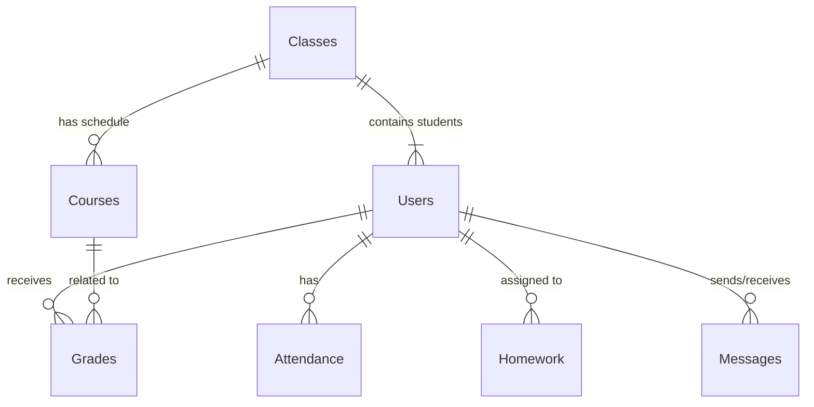

# Schéma de Base de Données (Firestore)

Bien que Firestore soit une base de données NoSQL orientée documents (sans schéma strict), l'application suit un modèle de données rigoureux défini par les interfaces TypeScript.

Ce document décrit la structure logique des collections, des documents et leurs relations.

## 📊 Vue d'ensemble du Modèle

## 🗂️ Collections Principales

### `users`
Stocke tous les utilisateurs de l'application. Le champ `role` détermine les champs supplémentaires disponibles.

| Champ | Type | Description |
|-------|------|-------------|
| `id` | string | UID Firebase Auth |
| `name` | string | Nom complet |
| `email` | string | Email unique |
| `role` | string | `student` \| `parent` \| `teacher` \| `director` |
| `avatar` | string? | URL de la photo de profil |
| `phone` | string? | Numéro de téléphone |

#### Spécifique `student`
| Champ | Type | Description |
|-------|------|-------------|
| `classId` | string | Référence vers `classes` |
| `parentId` | string | Référence vers `users` (parent) |

#### Spécifique `teacher`
| Champ | Type | Description |
|-------|------|-------------|
| `subjects` | string[] | Liste des matières enseignées |
| `classIds` | string[] | Liste des classes assignées |

---

### `classes`
Représente un groupe d'élèves (ex: "5ème A").

| Champ | Type | Description |
|-------|------|-------------|
| `id` | string | Auto-ID |
| `name` | string | Nom de la classe |
| `grade` | string | Niveau scolaire |
| `teacherId` | string | Professeur principal |

---

### `courses`
Définit l'emploi du temps et les matières.

| Champ | Type | Description |
|-------|------|-------------|
| `classId` | string | Classe concernée |
| `subject` | string | Matière (Maths, Arabe...) |
| `teacherId` | string | Enseignant responsable |
| `dayOfWeek` | number | 1 (Lundi) à 7 (Dimanche) |
| `startTime` | string | Format HH:mm |
| `endTime` | string | Format HH:mm |

---

### `grades`
Notes et évaluations individuelles.

| Champ | Type | Description |
|-------|------|-------------|
| `studentId` | string | Élève noté |
| `courseId` | string | Cours concerné |
| `score` | number | Note obtenue |
| `maxScore` | number | Note maximale (ex: 20) |
| `type` | string | `exam`, `homework`, etc. |
| `date` | string | Date de l'évaluation |

---

### `attendance`
Suivi des absences et retards.

| Champ | Type | Description |
|-------|------|-------------|
| `studentId` | string | Élève concerné |
| `classId` | string | Classe de l'élève |
| `date` | string | Date de l'absence |
| `status` | string | `absent`, `late`, `present` |
| `justification` | string? | Motif si justifié |

---

### `messages`
Système de messagerie interne.

| Champ | Type | Description |
|-------|------|-------------|
| `senderId` | string | Expéditeur |
| `receiverId` | string | Destinataire (ou 'all' pour broadcast) |
| `content` | string | Corps du message |
| `read` | boolean | Statut de lecture |
| `timestamp` | string | Date d'envoi |

---

### `homework`
Cahier de textes numérique.

| Champ | Type | Description |
|-------|------|-------------|
| `classId` | string | Classe assignée |
| `subject` | string | Matière |
| `dueDate` | string | Date limite |
| `description` | string | Contenu du devoir |
| `attachments` | string[]? | Liens vers fichiers joints |

## 📜 Système de Bulletins (Nouveau)

Ces collections gèrent la génération des bulletins officiels.

*   `academicPeriods` : Trimestres ou semestres (dates de début/fin).
*   `gradeCategories` : Types de notes (Contrôle continu, Examen final) avec pondération.
*   `courseGrades` : Notes agrégées par cours et par période.
*   `teacherComments` : Appréciations des professeurs par matière et période.

## 🔗 Relations & Dénormalisation

Firestore ne supportant pas les jointures (JOIN), certaines données sont **dénormalisées** (dupliquées) pour optimiser la lecture.

*   **Exemple** : Dans le document `Grade`, on stocke souvent `studentName` en plus de `studentId`.
*   **Avantage** : Permet d'afficher la liste des notes sans avoir à récupérer chaque document `User`.
*   **Inconvénient** : Si un étudiant change de nom, il faut mettre à jour tous ses documents `Grade` (ou accepter l'incohérence historique).
