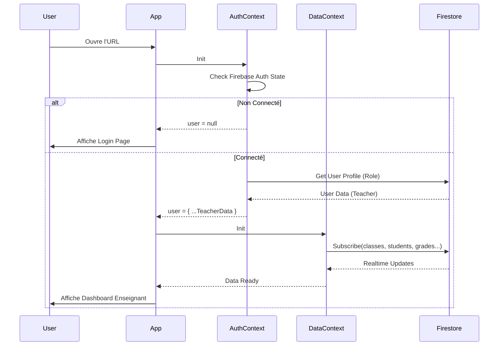
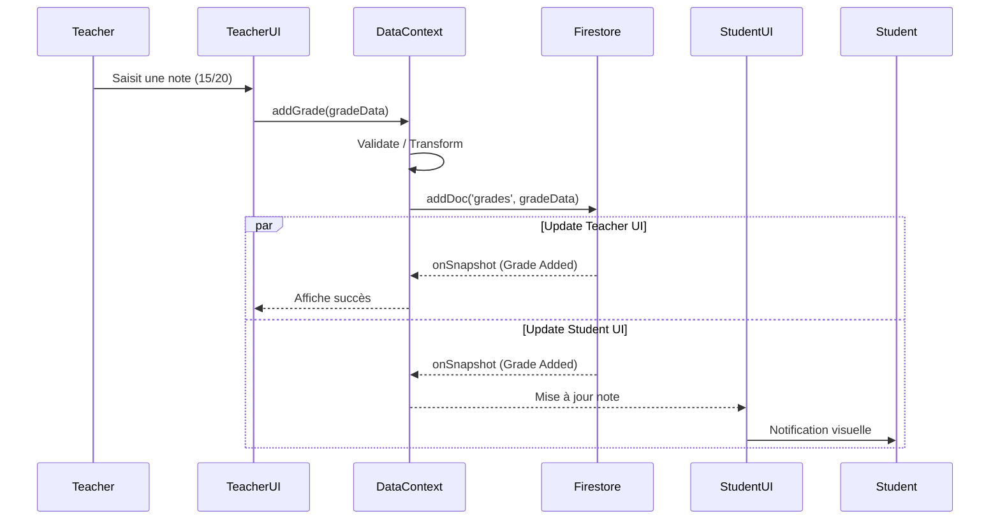
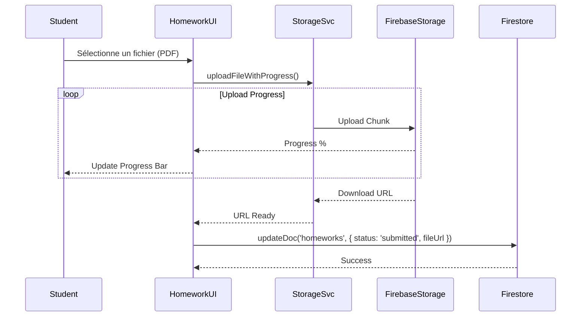

# Flux Critiques (Workflows)

Ce document décrit les processus les plus importants de l'application.

## 1. 🔐 Authentification & Initialisation

Le chargement initial est complexe car il dépend de deux sources de vérité : Firebase Auth (identité) et Firestore (rôle/profil).

## 2. 📝 Saisie de Notes (Teacher Workflow)

Ce flux montre comment une note saisie par un professeur arrive instantanément chez l'élève.

## 3. 📂 Soumission de Devoir (Student Workflow)

Processus d'upload de fichier et mise à jour du statut.

